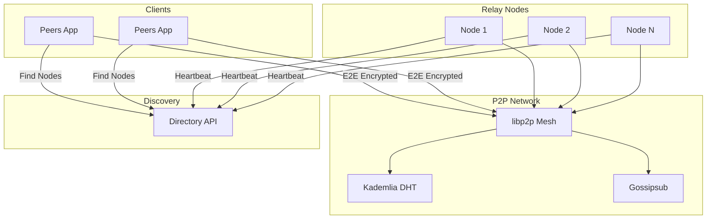

# PeersTech

A set of tools for decentralized communication. No central servers. No accounts. No databases.

## Projects

<Cards>
  <Card>
    ### Peers
    An end-to-end encrypted messenger. Peer-to-peer over libp2p.

    [Get Started](/docs/peers)
  </Card>
  <Card>
    ### Directory API
    Node registry and discovery. Clients find relay nodes without pasting addresses.

    [Get Started](/docs/dir-api)
  </Card>
  <Card>
    ### Pterodactyl Egg
    Run relay nodes as Pterodactyl servers. One-click deployment.

    [Get Started](/docs/ptero-egg)
  </Card>
</Cards>

## How it works

## Design principles

- Self-certifying identities. Ed25519 keys embedded in peer IDs.
- NAT traversal through Circuit Relay v2 and DCUtR hole punching.
- Runs on Raspberry Pi, old laptops, and cheap VPSs.
