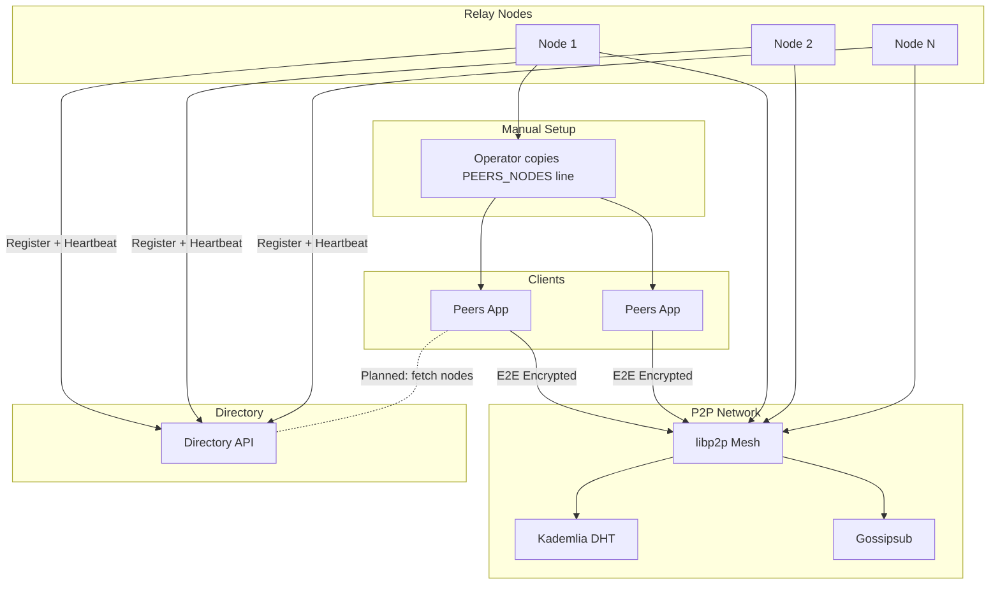

# PeersTech

Tools for decentralized communication. No central servers. No accounts. No databases.

## Projects

<Cards>
  <Card>
    ### Peers
    An end-to-end encrypted messenger. Peer-to-peer over libp2p.

    [Get Started](/docs/peers)
  </Card>
  <Card>
    ### Directory API
    A live registry of relay nodes. Client integration is planned, not yet wired.

    [Get Started](/docs/dir-api)
  </Card>
  <Card>
    ### Pterodactyl Egg
    Run relay nodes as Pterodactyl servers. One-click deployment.

    [Get Started](/docs/ptero-egg)
  </Card>
</Cards>

## How it works

Peers find each other over the public IPFS DHT. That solves discovery. Relay nodes solve reachability: both NAT'd peers dial the same node, reserve a circuit, and chat. DCUtR then tries to upgrade them to a direct connection.

Today, an operator copies the `PEERS_NODES=` line from `peers --node` and hands it to both users, who paste it into `PEERS_NODES` or `nodes.json`. The Directory API already accepts registrations and heartbeats from nodes. Client fetching is the planned next step, not yet wired.

## Design principles

- Self-certifying identities. Ed25519 keys embedded in peer IDs.
- Serverless by default. No canonical node list ships with Peers, since that would make those nodes a central dependency.
- NAT traversal through Circuit Relay v2 and DCUtR hole punching.
- Runs on Raspberry Pi, old laptops, and cheap VPSs. A node uses 30 to 60 MB of RAM.
